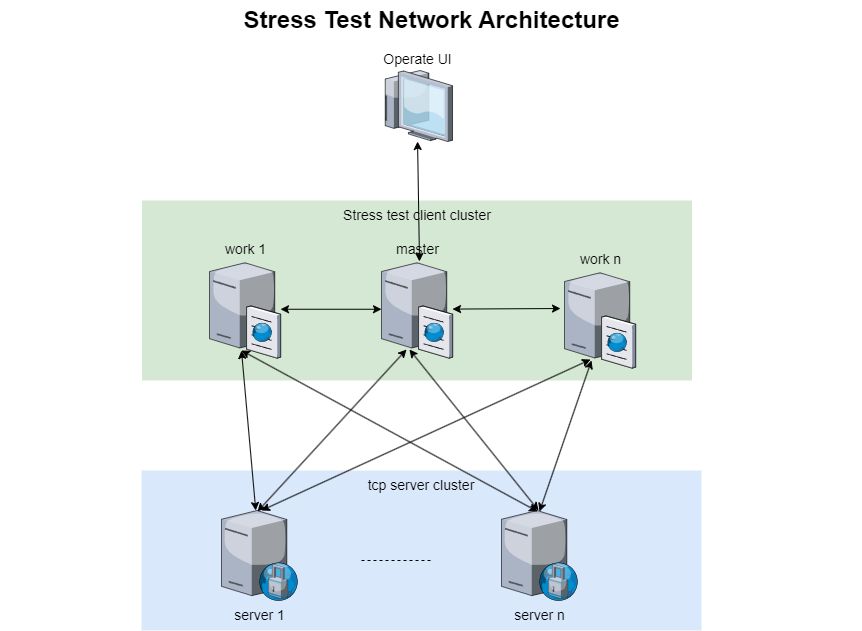

# Tcp Stress Test Tool

&nbsp;&nbsp;&nbsp;&nbsp;Distributed customized TCP protocol stress testing,statistics tool.
Because the TCP protocol of each project is different, the project cannot be directly used.
You need to modify the TCP packet logic and application logic by yourself.

| Directory | Description                   |
|-----------|-------------------------------|
| client    | tcp client logic(need modify) |
| config    | config file                   |
| core      | core logic                    |
| example   | server demo                   |
| res       | document,script               |



## Features

* Cluster implementation, support for maximum pressure load
* Message delay (minimum, maximum, average)
* Traffic statistics (average, total)
* Server CPU and memory consumption
* Request message and respond message are counted separately
* Message statistics support lua expression filtering

## Usage

### Command line

```shell
# 1. Clone Project
git clone https://github.com/jzyong/TcpStressTesting.git
cd TcpStressTesting

# 2. Build and run tool, change the ip address of the configuration file
go build
.\TcpStressTesting.exe --config config/application_config_jzy_master.json

# 3. Run example server
cd .\example\
go test

# 4. Start and stop test
 cd .\core\rpc\
 go test -v -run StartTest
 go test -v -run StopTest
```

### Docker

change the ip address of the configuration file

```shell
docker-compose up -d
```

### Statistical UI

[UI Client](https://github.com/jzyong/TcpStressTestingUI)   
[Download](#)  
TODO

## TODO

* Unity 界面统计整理


